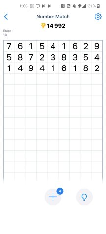

# NumberMatchSolver 

This is a solver for the classic number matching game, written in C++ under MIT license.



## principles

Recursion. Complexity is reduced by deleting the grids already played.

By default
- the grid has 9 columns,
- numbers can match horizontally, vertically or diagonally,
- the solver stops after first winning sequence is attained (configurable),
- the grid numbers can be duplicated until 4 times when no cut is possible,
- the winning sequence is shown in once, but you can unroll it interactively.

These topics are configurable.

## build
The build process uses [cmake](https://cmake.org/) and your favorite C++ compiler.
```
➜  cmake . && make
```

## run
```
➜  NumberMatchSolver ./numberMatchSolver -h

NumberMatchSolver

syntax: numberMatchSolver [options] <grid>
Options can be:
-o, --one-cut: find the first playable cut only
-c, --continue: try to find all winning sequences (can be very long)
-i, --interactive: ask user for next step
-l, --line-length <line length>: set the grid line length, must be >=2 (default 9)
-a, --add <num>: max times numbers can be added, must be >=0 (default 4)
-d, --diagonals: make diagonal numbers match too, can be y or n (default y)
-h, --help: this help message

ex: ./numberMatchSolver --interactive 262557596931762454465213897
```

## which game does it solves
[Number Match](https://play.google.com/store/apps/details?id=com.easybrain.number.puzzle.game) by Easybrain

[Number Match](https://play.google.com/store/apps/details?id=com.board.free.number.match.puzzle.game) by Happy Coloring Platform

[Numberama](https://play.google.com/store/apps/details?id=com.kila.zahlenspielpro.lars) and [Numberama 2](https://play.google.com/store/apps/details?id=com.kila.zahlenspiel2.lars) by Lars Feßen

etc.
